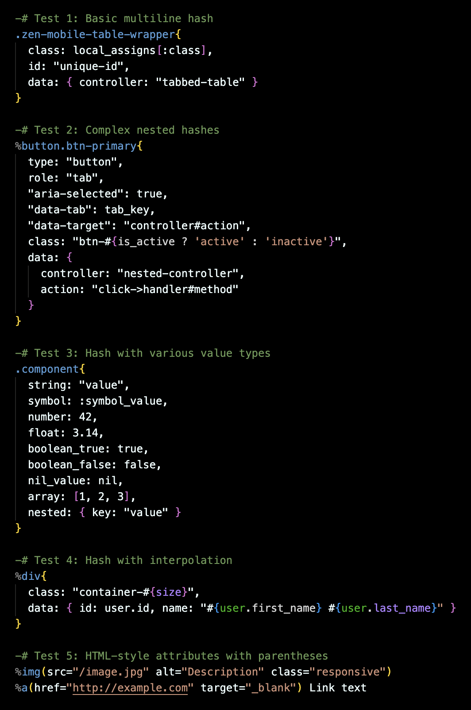
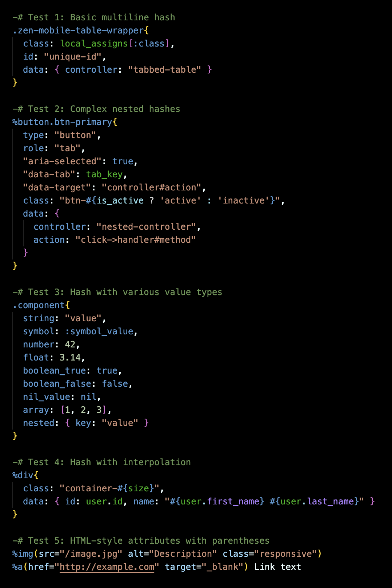

# HAML Enhanced

Enhanced HAML syntax highlighting for Visual Studio Code with proper multi-line hash support.

## ⚠️ Important: Conflicting Extensions

**If you have other HAML syntax highlighting extensions installed, you must disable them** to avoid conflicts and unwanted highlighting effects. Multiple HAML extensions can interfere with each other and cause incorrect syntax highlighting.

To disable conflicting extensions:
1. Open VS Code Extensions (`Cmd+Shift+X` / `Ctrl+Shift+X`)
2. Search for "HAML" or "haml"
3. Disable any other HAML syntax highlighting extensions (keep only "HAML Enhanced" enabled)

Common conflicting extensions include:
- "HAML" (by various authors)
- "HAML Syntax Highlighting"
- Any other extension that provides HAML language support

## Features

- **Multi-line Hash Support**: Properly highlights hash keys, values, and symbols across multiple indented lines
- **Ruby Embedded Code**: Full syntax highlighting for embedded Ruby expressions
- **HAML Tags**: Complete support for HAML tags, classes, and IDs
- **Ruby Variables & Symbols**: Proper highlighting of variables, symbols, and constants
- **Block Parameters**: Highlights block parameters and pipes
- **Doctype Declarations**: Highlights `!!!` doctype declarations
- **Object References**: Highlights `[@object]` syntax
- **String Interpolation**: Proper highlighting of `#{}` interpolations
- **Multi-line Comments**: Proper highlighting for HTML comments spanning multiple lines
- **Filters**: Comprehensive syntax highlighting for all HAML filters:
  - **Ruby** (`:ruby`) - Full Ruby syntax highlighting
  - **CSS** (`:css`) - CSS syntax highlighting
  - **JavaScript** (`:javascript`) - JavaScript syntax highlighting
  - **SASS** (`:sass`) - SASS syntax highlighting with variables, mixins, and nesting
  - **SCSS** (`:scss`) - SCSS syntax highlighting
  - **Markdown** (`:markdown`, `:md`) - Markdown syntax highlighting
  - **CoffeeScript** (`:coffee`, `:coffeescript`) - CoffeeScript syntax highlighting
  - **HTML** (`:html`) - HTML syntax highlighting
  - **ERB** (`:erb`) - ERB syntax highlighting with embedded Ruby code
  - **LESS** (`:less`) - LESS syntax highlighting
  - **Textile** (`:textile`) - Textile syntax highlighting
  - **Plain** (`:plain`) - Plain text filter
  - **Escaped** (`:escaped`) - Escaped text filter
  - **Preserve** (`:preserve`) - Preserve whitespace filter
  - **CDATA** (`:cdata`) - CDATA filter

## Screenshots

### Before (Standard HAML Extension)

*Other extensions treat continuation lines as plain text*

### After (HAML Enhanced)

*HAML Enhanced properly highlights all elements*

## Why HAML Enhanced?

The standard HAML extensions in VS Code have limited support for multi-line hash syntax. When you write HAML code like this:

```haml
.zen-mobile-table-wrapper{
  class: local_assigns[:class],
  data: { controller: "tabbed-table", "tabbed-table-active-tab-value": local_assigns[:active_tab] }
}
```

Other extensions treat the continuation lines as plain text. HAML Enhanced properly recognizes and highlights:
- Hash keys (`class:`, `data:`)
- Symbols (`:class`, `:active_tab`)
- Variables (`local_assigns`, `tab_key`)
- Strings and their contents
- Nested hashes and arrays
- Block parameters (`|user|`, `|tab, index|`)

## Installation

### From VS Code Marketplace
1. Open VS Code
2. Go to Extensions (`Cmd+Shift+X` / `Ctrl+Shift+X`)
3. Search for "HAML Enhanced"
4. Click Install

Or install directly from the [VS Code Marketplace](https://marketplace.visualstudio.com/items?itemName=EdColen.haml-enhanced)

### From Open VSX
1. Open VS Code (or compatible editor)
2. Configure Open VSX registry in your [user settings](https://open-vsx.org/user-settings/extensions)
3. Go to Extensions (`Cmd+Shift+X` / `Ctrl+Shift+X`)
4. Search for "HAML Enhanced"
5. Click Install

Or install directly from [Open VSX](https://open-vsx.org/extension/EdColen/haml-enhanced)

## Usage

Once installed, the extension automatically activates for all `.haml` files.

## Development

To work on this extension:

```bash
# Install dependencies
npm install

# Open in VS Code
code .

# Press F5 to open Extension Development Host
```

## Known Limitations

- This extension provides syntax highlighting only
- For Ruby code completion, use a Ruby language extension alongside this one

## Contributing

Issues and pull requests are welcome!

## License

MIT

## Author

Ed Colen

